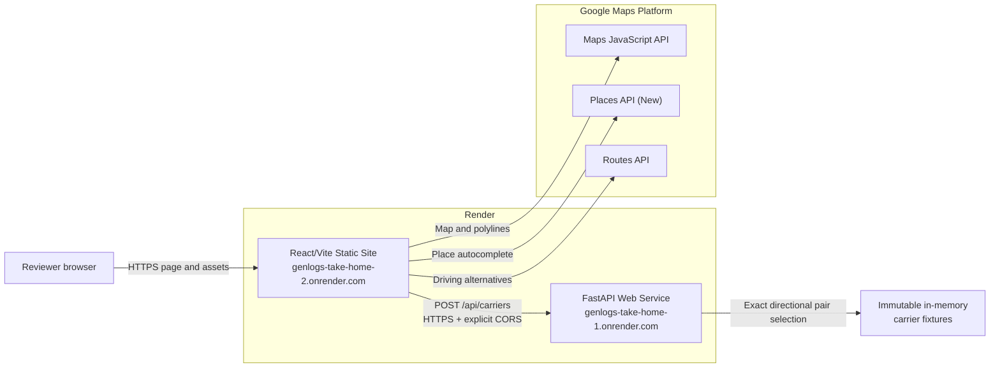

# Two-Service Architecture

The production deployment deliberately uses one Render Static Site for the browser application and one Render Web Service for the carrier API.

## Deployment configuration

- The frontend build receives `VITE_GOOGLE_MAPS_API_KEY` and `VITE_API_BASE_URL=https://genlogs-take-home-1.onrender.com`.
- The backend receives `ALLOWED_ORIGINS=https://genlogs-take-home-2.onrender.com`.
- Google calls stay in the browser. FastAPI does not proxy them.
- Carrier data stays in process. There is no database, cache, queue, authentication service, or background worker.

See the [README](../../README.md) for setup, deployment, and verification commands.
