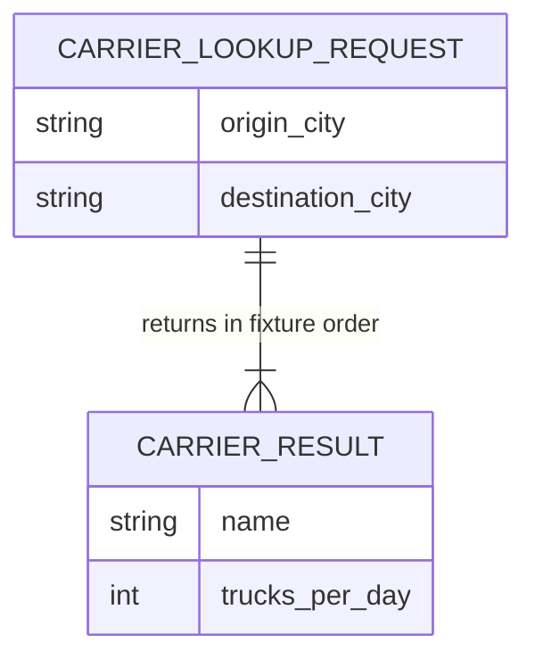

# Conceptual ER / Data-Contract Diagram

This project has no database. The diagram documents the transient request/response relationship and the immutable carrier fixture shape; it does not represent persisted tables.

The normalized ordered `(origin_city, destination_city)` pair selects one of three immutable fixtures:

- New York City → Washington DC
- San Francisco → Los Angeles
- UPS/FedEx fallback for every other valid directional pair

Reversing a special pair selects the fallback. No lookup creates, updates, or deletes data.

See the [carrier API contract](../../README.md#carrier-api) for the wire format.
